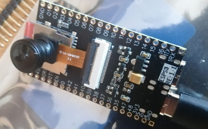

## A WiFi-car with a camera based on two ESP32 microcontrollers

 .
 .

### Purpose
This project continues the theme of radio-controlled models, this time based on ESP32 microcontrollers. The model incorporates the popular OV2640 video camera, which the operator can view in a web application window on a PC (smartphone or tablet) on the home network, while simultaneously controlling the vehicle using the app.

### Composition, structure and operating mode
The model can only operate in operator-controlled mode. Functions are distributed between two ESP32 microcontrollers. The ESP32-S3-CAM microcontroller is the master, and the ESP32-C3 supermini is the slave. The master microcontroller receives operator commands via WiFi, provides video streaming, and transmits motion control commands to the slave microcontroller. Communication between the master and slave microcontrollers is via a serial interface at 115200 bps. \
The decision to use two microcontrollers was prompted by the insufficient number of available contacts on the ESP32-S3-CAM board. These are already largely used when connecting the video camera. Furthermore, delegating motion control functions to another microcontroller allows, if necessary, to decouple the power supply from the video camera and the motor. \
The model platform is a two-wheel chassis with DC motors and gearboxes. The L298N motor driver is connected to a power supply consisting of two 18650 battery cells with a total voltage of 7.4V and a BMS 2S protection board. The driver, in turn, generates a stabilized 5V output voltage for the master and slave microcontroller boards.  
The car has headlights (two LEDs) and a switch. The headlight turn-on signal is pre-amplified by an SN75452 open collector output IC. \
All necessary components were purchased on Aliexpress. The photo shows the boards for both microcontrollers:

 .  

The connection diagram of the elements is shown below.: 

### Software
The microcontroller control programs were developed using the Arduino IDE 2.3.8, C++ programming language. The source code for the master and slave microcontrollers is provided in the following files: *src/S3CAM_master.ino* и *src/C3_slave.ino*.

#### Master MCU
The program for the host microcontroller is a web server from the Arduino IDE example library, adapted to the project's needs. A connection was established between the OV2640 video camera and two versions of the ESP32-S3-CAM development boards purchased from Aliexpress.
The program generates a simple SPA application (an HTML page containing a Javascript script) for controlling the car from a browser. UART1 is enabled on pins 17 and 18 for communication with the slave controller. UART0 is used for debugging the application.  
Before compiling the program in the Arduino IDE, you must specify the *ssid* and *password* of your home network. After compiling and uploading the program to the MCU, restart the MCU, open the serial monitor, wait for the MCU to establish a WiFi connection to your home network, and use the resulting IP address of the MCU to enter it in the address bar of your computer (smartphone) browser. The application's HTML page should load. The LED headlights will blink twice to indicate that the application is ready to launch.

#### Slave MCU
The program for the ESP32-C3 supermini slave MCU is similar in structure to the Arduino Nano program from my *arduinobtcar* project, but has a minimal set of features. UART1 is enabled on pins 5 and 6 for communication with the master controller. UART0 is used for debugging the application. \
Before compiling the program in the Arduino IDE, configure the following settings: *Board: "Lolin C3 Mini"; USB-CDC on Boot: "Enabled"; Upload Speed: "115200"*. These settings are required for the serial monitor to function properly when using the ESP32-C3 supermini. \
Implementation details can be found in the comments in the source code of the programs.

