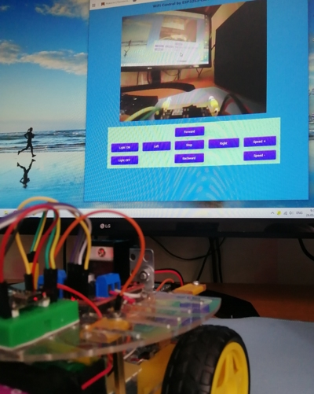
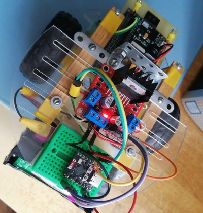
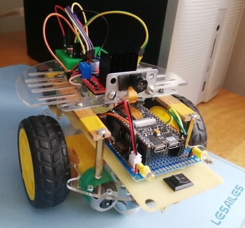
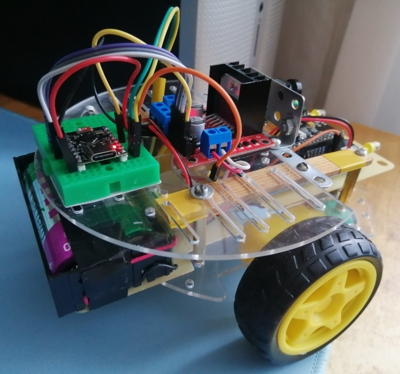
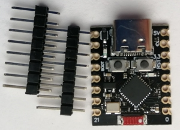
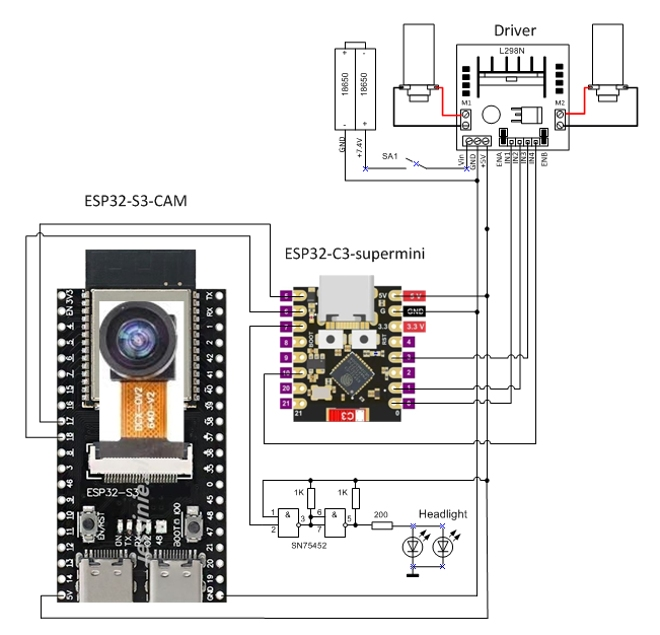

## WiFi-мобиль с камерой на двух контроллерах ESP32

 .
 .

### Назначение
Данный проект продолжает тему радиоуправляемых моделей, на этот раз на базе микроконтроллеров ESP32. В конструкцию модели включена популярная видеокамера OV2640, картинку с которой может наблюдать оператор в окне Web-приложения на ПК (смартфоне или планшете) в пределах домашней сети, одновременно управляя движением автомобиля с помощью этого приложения.

### Состав, структура и режим работы
Модель может функционировать только в режиме управления оператором. Выполняемые функции распределены между двумя микроконтроллерами ESP32. Микроконтроллер ESP32-S3-CAM является ведущим, а ESP32-C3 supermini - ведомым. Ведущий МК принимает команды оператора по WiFi, обеспечивает трансляцию видео, передает команды управления приводом ведомому МК. Связь между ведущим и ведомым микроконтроллерами осуществляется по серийному интерфейсу со скоростью 115200 бит/с. \
Решение использовать два МК вызвано недостаточным количеством свободных контактов на плате ESP32-S3-CAM. Они  уже, в основном, задействованы при подключении видеокамеры. Кроме того, делегирование функций управления движением другому МК позволяет, при необходимости, развязать питание видеокамеры и привода. \
Платформа модели представлет собой двухколесное шасси с двигателями постоянного тока и редукторами. Драйвер двигателей L298N подключен к источнику питания, состоящему из двух аккумуляторных элементов 18650 с суммарным напряжением 7.4V и платы защиты BMS 2S. Драйвер, в свою очередь, формирует выходное стабилизированное напряжение 5V для плат ведущего и ведомого микрокотроллеров.  
Автомобиль имеет передние фары (два светодиода) и выключатель. Сигнал включения фар предварительно усиливается с помощью микросхемы SN75452 с открытым коллектором. \
Все необходимые компоненты приобретены на Aliexpress. На фото - платы обоих микроконтроллеров:

 .

Схема соединения элементов показана ниже: 

### Программное обеспечение
Разработка программ управления микроконтроллерами выполнена в среде Arduino IDE 2.3.8, язык программирования C++. Исходные тексты программ для ведущего и ведомого микроконтроллеров представлены, соответственно, в файлах *src/S3CAM_master.ino* и *src/C3_slave.ino*. \

#### Ведущий МК
Программа для ведущего микроконтроллера представляет собой Web-сервер из библиотеки примеров Arduino IDE, адаптированный к задачам проекта. Выполнена привязка видеокамеры OV2640 к двум версиям плат разработки ESP32-S3-CAM, купленных на Aliexpress. \
Программа формирует простое SPA-приложение (HTML-страницу) для управления автомобилем из браузера. Для связи с ведомым контроллером на пинах 17,18 поднят интерфейс UART1. Интерфейс UART0 служит для отладки приложения. \
Перед компиляцией программы в Arduino IDE необходимо указать *ssid* и *password* домашней локальной сети. После компиляции и загрузки программы в МК следует перезапустить МК, открыть серийный монитор, дождаться установления WiFi-соединения МК с домашней сетью и использовать полученный при этом ip-адрес МК для указания его в адресной строке браузера вашего компьютера (смартфона). Должна загрузиться HTML-страница приложения. Сигналом готовности к запуску приложения служит двойной blink светодиодами-фарами.

#### Ведомый МК
Программа для ведомого МК ESP32-C3 supermini аналогична по структуре программе для Arduino Nano из моего проекта *arduinobtcar*, но имеет минимальный набор функций. Для связи с ведущим контроллером на пинах 5,6 поднят интерфейс UART1. Интерфейс UART0 применяется для отладки приложения. \
Перед компиляцией программы в Arduino IDE выполните следующие настройки: *Board:"Lolin C3 Mini"; USB-CDC on Boot:"Enabled"; Upload Speed:"115200"*. Они требуются для штатной работы серийного монитора при использовании ESP32-C3 supermini. \
Подробности реализации можно узнать из комментариев в исходном тексте программ.

